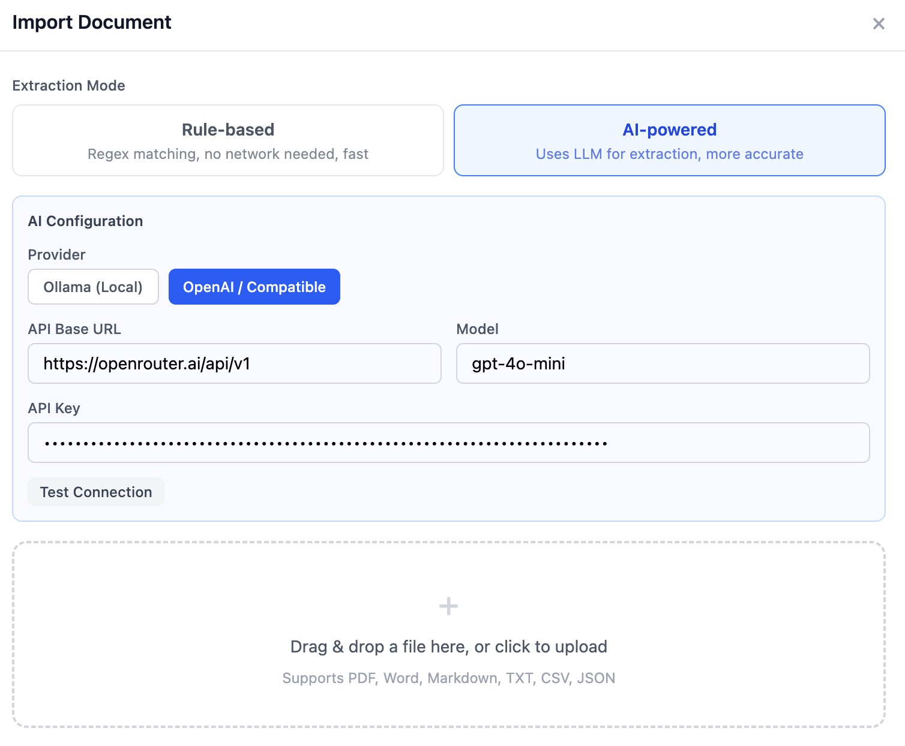

# AI 简历生成器

一个纯前端的智能简历制作工具，支持 AI 文档导入。无需后端，完全在浏览器中运行，可托管在 GitHub Pages。

## 功能

- **多格式导入** — 支持上传 PDF、Word、Markdown、TXT、CSV、JSON 文件
- **AI 智能提取** — 通过 Ollama（本地）或 OpenAI 兼容接口，自动解析简历内容并填入模板
- **规则匹配提取** — 基于正则的离线提取方案，无需 API 也能用
- **3 套模板** — 经典（单栏衬线）、现代（双栏侧边栏）、极简（大量留白）
- **实时预览** — A4 尺寸实时渲染，根据内容量自动调整行间距
- **模块排序** — 自由调整简历各模块的显示顺序
- **AI 生成简介** — 根据已填写的信息，一键生成职业摘要
- **中英双语** — 界面和简历内容均支持中文/英文切换
- **导出 PDF** — 浏览器原生打印导出，完整保留样式
- **数据持久化** — 自动保存到 localStorage，支持 JSON 导出/导入

## 技术栈

- React 19 + TypeScript + Vite
- Tailwind CSS 4
- Zustand（状态管理 + localStorage 持久化）
- react-i18next（国际化）
- pdfjs-dist / mammoth / marked / papaparse（文档解析）

## 快速开始

```bash
npm install
npm run dev
```

打开 http://localhost:5173/ai_resume_generator/

## AI 配置

### Ollama（本地，免费）

1. 安装 [Ollama](https://ollama.com)
2. 拉取模型：`ollama pull qwen2.5:7b`（中文推荐）或 `ollama pull llama3:8b`
3. 在应用中点击 **导入文档** → 选择 **AI 智能提取** → 选择 **Ollama (本地)**

### OpenAI / 兼容接口

1. 在应用中点击 **导入文档** → 选择 **AI 智能提取** → 选择 **OpenAI / 兼容接口**
2. 填入 API 地址、Key 和模型名称
3. 支持 DeepSeek、通义千问等 OpenAI 兼容服务

### 免费方案：OpenRouter

[OpenRouter](https://openrouter.ai) 提供多种模型的免费试用额度，可作为 OpenAI 兼容接口使用：



- API 地址：`https://openrouter.ai/api`
- 模型：在 [openrouter.ai/models](https://openrouter.ai/models) 筛选 "Free" 模型

## 构建与部署

```bash
npm run build
```

## 许可证

[CC BY-NC 4.0](./LICENSE) — 可自由使用和修改，**禁止商业用途**。
